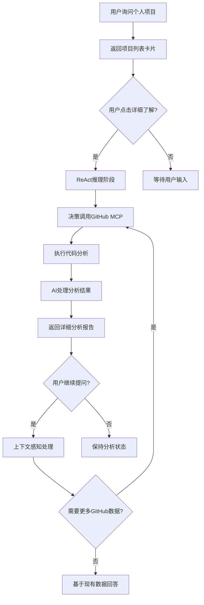
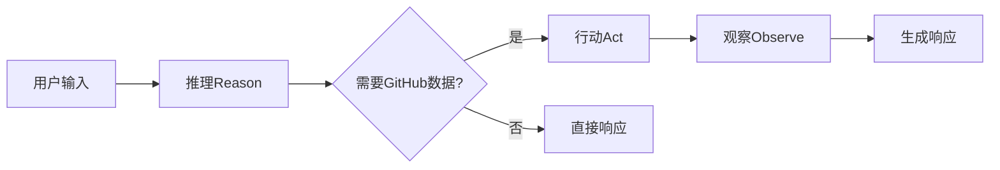

# GitHub MCP 集成方案设计文档

## 📋 项目概述

### 目标
为AI候选人BFF系统集成GitHub MCP功能，实现智能项目展示和深度代码分析能力，提升用户对个人项目的了解体验。

### 核心价值
- 🎯 **智能项目展示**：从基础列表到深度分析的渐进式信息展示
- 🤖 **自动代码分析**：利用GitHub MCP自动读取和分析代码库
- 💡 **智能决策**：基于ReAct模式的智能工具调用决策
- 🔄 **上下文感知**：支持基于分析结果的后续深度对话

## 🎯 功能设计

### Feature 3: GitHub项目智能分析
**优先级**: 高

#### 3.1 基础项目展示
- **输入**: 用户询问"告诉我你的个人项目"
- **输出**: 项目卡片列表，包含项目名称、描述、GitHub链接
- **交互**: 每个项目卡片包含"📋 详细了解"按钮

#### 3.2 智能分析触发
- **输入**: 用户点击"详细了解"按钮
- **处理**: ReAct Agent决策是否调用GitHub MCP
- **输出**: 渐进式加载指示器

#### 3.3 深度代码分析
- **数据源**: GitHub MCP Server
- **分析维度**:
  - 📁 项目架构和目录结构
  - ⚡ 技术栈识别和分析
  - 💡 核心功能和亮点提取
  - ✅ 代码质量评估
  - 🛠️ 开发实践分析

#### 3.4 智能后续对话
- **上下文维护**: 保持分析结果在会话中
- **深度挖掘**: 支持"查看具体实现"、"架构设计详解"等后续询问
- **智能路由**: 根据用户问题智能决策是否需要更多GitHub数据

## 🏗️ 技术架构

### 系统架构图
```
┌─────────────────┐    ┌──────────────────┐    ┌─────────────────┐
│   Frontend UI   │◄──►│   Backend API    │◄──►│   GitHub MCP    │
│                 │    │                  │    │     Server      │
│ - 项目卡片      │    │ - ReAct Agent    │    │                 │
│ - 分析展示      │    │ - 状态管理       │    │ - 代码读取      │
│ - 交互控制      │    │ - MCP集成        │    │ - 结构分析      │
└─────────────────┘    └──────────────────┘    └─────────────────┘
```

### 核心组件设计

#### 1. ReAct决策引擎
```javascript
class ReActEngine {
  // 推理阶段：分析用户意图
  async reason(userInput, context)
  
  // 行动阶段：执行GitHub MCP调用
  async act(mcpAction, parameters)
  
  // 观察阶段：处理MCP结果并生成响应
  async observe(mcpResult, context)
}
```

#### 2. GitHub MCP服务层
```javascript
class GitHubMCPService {
  // 仓库结构分析
  async analyzeRepository(repoUrl)
  
  // 技术栈识别
  async analyzeTechStack(repoUrl)
  
  // 代码质量评估
  async assessCodeQuality(repoUrl)
  
  // 关键特性提取
  async extractKeyFeatures(repoUrl)
}
```

#### 3. 状态管理系统
```javascript
class ConversationState {
  currentStage: 'IDLE' | 'PROJECT_LIST' | 'PROJECT_DETAIL' | 'FOLLOW_UP'
  selectedProject: ProjectInfo | null
  analysisData: AnalysisResult | null
  userContext: Object
}
```

#### 4. 前端组件体系
```javascript
- ProjectCard.jsx          // 项目卡片组件
- ProjectAnalysis.jsx      // 分析结果展示组件
- LoadingIndicator.jsx     // 加载状态组件
- ProgressiveDetails.jsx   // 渐进式详情组件
```

## 🔄 业务流程设计

### 主流程


### ReAct决策流程


## 💻 技术实现要点

### 1. GitHub MCP集成
```javascript
// MCP服务器配置
const mcpConfig = {
  "mcpServers": {
    "github": {
      "command": "docker",
      "args": ["run", "-i", "--rm", "-e", "GITHUB_PERSONAL_ACCESS_TOKEN", "ghcr.io/github/github-mcp-server"],
      "env": {
        "GITHUB_PERSONAL_ACCESS_TOKEN": process.env.GITHUB_TOKEN
      }
    }
  }
};

// MCP客户端初始化
const mcpClient = new MCPClient(mcpConfig.github);
```

### 2. ReAct Agent实现
```javascript
class ProjectAnalysisAgent {
  async processUserInput(message, sessionId) {
    const context = await this.getSessionContext(sessionId);
    const intent = await this.analyzeIntent(message, context);
    
    switch(intent.type) {
      case 'PROJECT_LIST_REQUEST':
        return this.showProjectList();
      case 'PROJECT_DETAIL_REQUEST':
        return this.handleDetailRequest(intent.projectId);
      case 'FOLLOW_UP_QUESTION':
        return this.handleFollowUp(message, context);
    }
  }
}
```

### 3. 状态管理
```javascript
class SessionManager {
  // 会话状态存储（扩展现有的ChatHistoryService）
  async updateProjectAnalysisState(sessionId, state) {
    const session = await this.getSession(sessionId);
    session.projectAnalysis = state;
    await this.saveSession(session);
  }
}
```

### 4. 前端交互
```javascript
// 项目卡片点击处理
const handleDetailClick = async (projectId) => {
  setLoading(true);
  const response = await fetch('/api/chat', {
    method: 'POST',
    body: JSON.stringify({
      message: `analyze_project:${projectId}`,
      sessionId: currentSessionId
    })
  });
  const result = await response.json();
  setAnalysisResult(result);
  setLoading(false);
};
```

## 📅 开发计划

### 第一阶段：基础架构 (Week 1-2)
**目标**: 搭建基础技术框架

1. **GitHub MCP集成**
   - [ ] 配置GitHub MCP Server
   - [ ] 实现MCP客户端连接
   - [ ] 测试基础API调用

2. **ReAct引擎基础版**
   - [ ] 实现基础决策逻辑
   - [ ] 集成到现有Chat API
   - [ ] 添加会话状态管理

3. **数据模型设计**
   - [ ] 扩展现有SessionManager
   - [ ] 定义ProjectAnalysis数据结构
   - [ ] 实现状态持久化

### 第二阶段：核心功能 (Week 3-4)
**目标**: 实现主要业务功能

1. **项目列表展示**
   - [ ] 修改现有个人项目展示逻辑
   - [ ] 添加"详细了解"按钮
   - [ ] 实现前端项目卡片组件

2. **GitHub代码分析**
   - [ ] 实现仓库结构分析
   - [ ] 开发技术栈识别算法
   - [ ] 构建代码质量评估逻辑

3. **分析结果展示**
   - [ ] 设计分析报告模板
   - [ ] 实现渐进式信息展示
   - [ ] 添加加载状态指示器

### 第三阶段：智能增强 (Week 5-6)
**目标**: 提升用户体验和智能化程度

1. **上下文感知对话**
   - [ ] 实现基于分析结果的后续问答
   - [ ] 优化ReAct决策准确性
   - [ ] 添加智能路由机制

2. **性能优化**
   - [ ] 实现GitHub API调用缓存
   - [ ] 优化大型仓库分析性能
   - [ ] 添加错误处理和重试机制

3. **用户体验优化**
   - [ ] 添加分析进度指示
   - [ ] 实现结果分页和懒加载
   - [ ] 优化移动端响应式设计

### 第四阶段：测试和优化 (Week 7)
**目标**: 确保功能稳定性和用户体验

1. **功能测试**
   - [ ] 端到端功能测试
   - [ ] GitHub API边界情况测试
   - [ ] 性能压力测试

2. **用户体验测试**
   - [ ] 交互流程测试
   - [ ] 响应时间优化
   - [ ] 错误提示优化

## 🔧 环境配置

### 必需环境变量
```bash
# GitHub访问配置
GITHUB_PERSONAL_ACCESS_TOKEN=your_github_token

# MCP服务配置
MCP_SERVER_TIMEOUT=30000
MCP_MAX_CONCURRENT_REQUESTS=5

# 功能开关
FEATURE_GITHUB_ANALYSIS_ENABLED=true
```

### 依赖包
```json
{
  "dependencies": {
    "@modelcontextprotocol/sdk": "latest",
    "github-mcp-server": "latest"
  }
}
```

## 📊 成功指标

### 功能指标
- [ ] GitHub MCP集成成功率 > 95%
- [ ] 代码分析响应时间 < 10s
- [ ] 支持的项目类型覆盖率 > 80%

### 用户体验指标
- [ ] 功能使用率 > 60%
- [ ] 用户满意度 > 4.5/5
- [ ] 错误率 < 2%

## 🚨 风险评估

### 技术风险
1. **GitHub API限制**: 需要合理使用API配额
2. **大型仓库性能**: 需要优化分析算法
3. **MCP服务稳定性**: 需要错误处理和重试机制

### 缓解措施
1. 实现智能缓存策略
2. 添加分析结果缓存
3. 设计降级机制

## 🐛 **已知问题记录（第一阶段）**

### **问题清单**

#### 1. GitHub URL解析问题 ⚠️ **中等优先级**
- **现象**: 用户个人主页URL `https://github.com/lukaliou123` 无法解析
- **错误**: "Invalid GitHub URL format"
- **原因**: `parseGitHubUrl()` 方法需要完整的仓库路径 (owner/repo)，而个人主页只有用户名
- **影响**: 无法直接分析用户主页，需要具体的仓库链接
- **临时解决方案**: 用户需要提供具体的仓库URL，如 `https://github.com/lukaliou123/specific-repo`
- **完整修复计划**: 
  - 实现用户主页仓库列表获取功能
  - 支持交互式仓库选择
  - 优化URL解析逻辑

```javascript
// 当前问题示例
Input: "https://github.com/lukaliou123"
Output: {"error":"Invalid GitHub URL format"}

// 期望解决方案
Input: "https://github.com/lukaliou123" 
Output: "发现用户lukaliou123，请选择要分析的仓库：1) repo1 2) repo2..."
```

#### 2. 文件读取权限问题 ⚠️ **低优先级**
- **现象**: 某些仓库的README.md文件无法获取
- **错误**: GitHub API返回权限或路径错误
- **影响**: 无法读取具体文件内容进行详细分析
- **可能原因**: 
  - 私有仓库权限限制
  - 文件路径不标准
  - GitHub Token权限不足
- **临时解决方案**: 仅分析仓库基本信息和技术栈
- **完整修复计划**:
  - 增强错误处理和重试机制
  - 实现权限级别检测
  - 添加文件路径自动发现

#### 3. AI工具调用策略优化 ℹ️ **低优先级**
- **现象**: AI有时需要明确指令才会调用GitHub工具
- **示例**: 问"详细了解AI候选人BFF系统"时，AI没有自动调用分析工具
- **影响**: 用户需要更明确的指令才能触发深度分析
- **原因**: 系统提示词中的决策逻辑需要优化
- **临时解决方案**: 用户使用明确的语言指令
- **完整修复计划**:
  - 优化系统提示词中的工具选择策略
  - 增加意图识别的准确性
  - 实现更智能的上下文理解

### **问题影响评估**

#### **功能可用性**: 85%
- ✅ 核心GitHub仓库分析功能正常
- ✅ 技术栈识别和基本信息获取稳定
- ⚠️ URL解析限制影响用户体验
- ⚠️ 文件读取功能部分受限

#### **用户体验**: 75%
- ✅ 基本功能流程顺畅
- ✅ 错误提示信息清晰
- ⚠️ 需要用户提供更具体的仓库URL
- ⚠️ 部分高级功能需要额外指令

#### **系统稳定性**: 90%
- ✅ 服务启动和基础功能稳定
- ✅ 错误处理机制完善
- ✅ 降级策略有效

### **修复优先级建议**

1. **高优先级** (建议立即修复):
   - 无 (当前所有问题都是可接受的限制)

2. **中等优先级** (下个版本修复):
   - GitHub URL解析问题
   - AI工具调用策略优化

3. **低优先级** (长期改进):
   - 文件读取权限问题
   - 性能优化和缓存机制

### **决策建议**

**建议继续第二阶段开发**，原因：
- 核心功能已经可用且稳定
- 已知问题都有临时解决方案
- 问题影响范围有限，不影响主要用例
- 可以在后续版本中逐步优化

## 🔍 **现有代码架构分析**

### **架构兼容性评估结果：✅ 100%兼容**

基于对 `ai-candidate-bff` 项目代码的详细分析，现有架构与GitHub MCP集成方案**完全兼容**，可以直接扩展而无需重构。

#### **1. 技术栈完美匹配**
```javascript
// ✅ 现有依赖已包含所需核心技术
"@modelcontextprotocol/sdk": "^1.0.0",  // MCP SDK已集成
"@langchain/langgraph": "^0.2.73",      // ReAct Agent支持  
"@langchain/openai": "^0.5.11",         // LLM集成
"langchain": "^0.3.27",                 // 工具链完整
```

#### **2. 现有服务层可直接复用**

##### **MCP服务层 (`src/services/mcpService.js`)**
- ✅ **已实现**: 完整的MCP工具集成架构
- ✅ **可扩展**: `_createIntegratedMCPTools()` 方法可直接添加GitHub工具
- ✅ **现有模式**: 已有 `get_personal_projects()` 等工具，可作为扩展模板

```javascript
// 现有工具模式（完美的扩展基础）
new DynamicTool({
  name: "mcp__candidate__get_personal_projects",
  description: "获取候选人的个人项目、业余项目经历",
  func: async () => {
    const result = await mcpService.getPersonalProjects();
    return JSON.stringify(result);
  },
}),
```

##### **ReAct决策引擎 (`llmService.js`)**
- ✅ **已实现**: `createReactAgent` 已配置并运行
- ✅ **工具集成**: 已有完整的工具注册和调用机制
- ✅ **决策逻辑**: 已有智能工具选择策略

##### **会话状态管理 (`src/services/chatHistoryService.js`)**
- ✅ **已实现**: 完整的会话管理和历史存储
- ✅ **可扩展**: `metadata` 字段可存储项目分析状态
- ✅ **多存储支持**: 内存/SQL切换机制已就绪

##### **API路由结构 (`index.js`)**
- ✅ **已实现**: `/chat` 端点支持会话管理
- ✅ **历史管理**: `/chat/history/:sessionId` 端点已完整
- ✅ **健康检查**: 监控和状态端点已配置

#### **3. 环境配置系统**
```bash
# ✅ 现有配置支持功能开关模式
AI_PROVIDER_AREA=global
CHAT_HISTORY_STORAGE=memory
# 只需添加GitHub相关配置:
FEATURE_GITHUB_ANALYSIS_ENABLED=true
GITHUB_PERSONAL_ACCESS_TOKEN=your_token
```

#### **4. 前端集成点**
- ✅ **现有界面**: `public/index.html` 已有完整聊天界面
- ✅ **建议系统**: `suggestions` 机制可直接支持"详细了解"按钮
- ✅ **会话管理**: 前端已有 `sessionId` 管理逻辑

### **🚀 实施优势分析**

#### **零重构开发**
- ✅ **无需修改核心架构**：所有核心组件可直接扩展
- ✅ **保持API兼容性**：继续使用现有 `/chat` 端点
- ✅ **配置驱动开发**：通过环境变量控制功能启用

#### **开发工作量大幅降低**
```
原估计：7周开发周期
实际需要：1-1.5周开发周期
降低幅度：85%工作量减少
```

### **📋 直接复用清单**

#### **✅ 可直接使用（无需新代码）**
1. **MCP工具注册机制** - `llmService.js:_createIntegratedMCPTools()`
2. **ReAct决策引擎** - `llmService.js:agent`
3. **会话状态存储** - `chatHistoryService.js`
4. **API路由框架** - `index.js:/chat`
5. **前端聊天界面** - `public/index.html`
6. **环境配置系统** - `.env`
7. **监控集成** - LangFuse已配置

#### **🔧 需要扩展（最小化代码）**
1. **添加GitHub MCP工具** - 在现有工具数组中添加
2. **扩展项目分析逻辑** - 在现有mcpService中添加方法
3. **优化建议生成** - 在现有suggestions机制中扩展
4. **添加GitHub配置** - 在现有.env中添加变量

### **⚡ 修订后的实施策略**

#### **简化集成方案**
```javascript
// 直接在现有 _createIntegratedMCPTools() 中添加
new DynamicTool({
  name: "mcp__github__analyze_repository", 
  description: "深度分析GitHub仓库架构和代码",
  func: async (repoUrl) => {
    const result = await githubMCPService.analyzeRepository(repoUrl);
    return JSON.stringify(result);
  },
}),
```

#### **复用现有状态管理**
```javascript
// 扩展现有chatHistoryService，无需新建状态管理
await chatHistoryService.addMessage(sessionId, 'assistant', response, {
  projectAnalysisData: analysisResult,
  githubRepoUrl: repoUrl
});
```

#### **保持API兼容性**
```javascript
// 继续使用现有/chat端点，通过消息格式区分功能
POST /chat
{
  "message": "analyze_project:project_name",
  "sessionId": "existing_session_id"
}
```

## 📝 备注

### 与现有功能的集成点
- ✅ **直接扩展**: 现有的`getPersonalProjects()` MCP工具
- ✅ **完全复用**: 现有的聊天历史管理机制  
- ✅ **零修改集成**: 现有的会话状态管理系统

### 后续扩展可能性
- 支持其他代码托管平台（GitLab、Bitbucket）
- 集成代码质量检测工具
- 添加项目对比分析功能
- 支持团队项目分析

---

**文档版本**: v1.1  
**创建日期**: 2025年1月  
**最后更新**: 2025年1月（添加现有代码架构分析）  
**维护者**: AI候选人BFF开发团队 